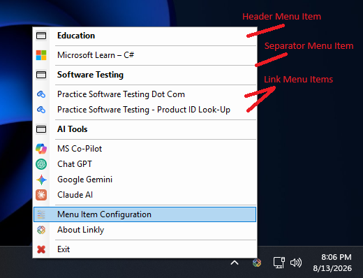
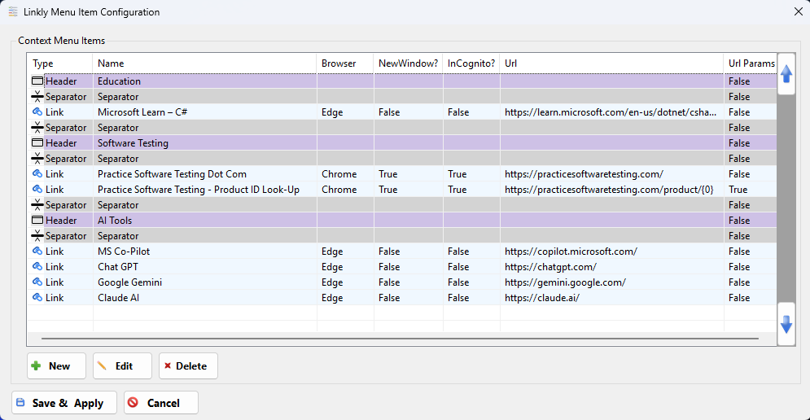
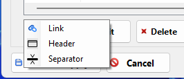
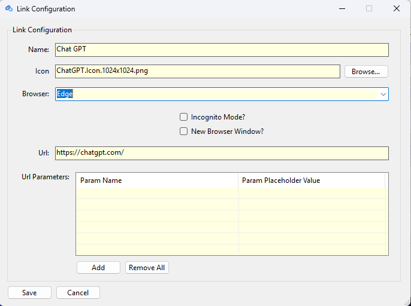
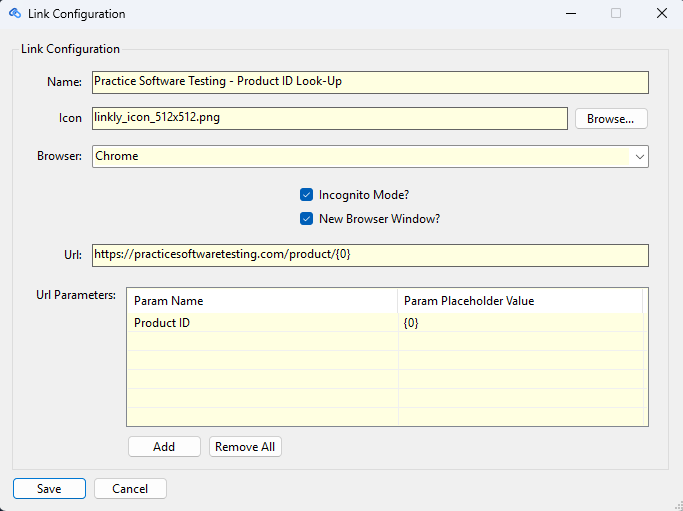
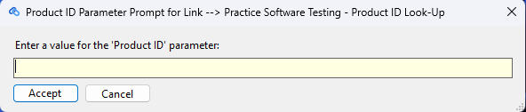

# Linkly

Linkly is a lightweight Windows system tray utility that puts a fully customizable context menu of hyperlinks right at your fingertips. Configure any number of links, organize them into sections, and launch them in the browser of your choice — all without cluttering your desktop or browser bookmarks bar.

## Version Control

<table>
  <tr><th>Version</th><th>Description</th><th>Date</th></tr>
  <tr><td>v1.0.0</td><td>Initial public release of Linkly</td><td>8/14/2026</td></tr>
  <tr>
    <td>v1.0.1</td>
    <td>Bug Fixes:
      <ul>
        <li>Fixed bug with the browser selection drop drown box defaulting to 'None' in Link Details Dialog.</li>
        <li>Set the Tab Order from top-to-bottom for all fields on both the Link & Link Details settings dialogs, as well as the Input Box dialog.</li>
        <li>Added field length limit on the Name field in the Link Details Dialog to 80 characters.</li>
        <li>Added field length limit on the Input Box Dialog text field to 70 characters.</li>
        <li>Locked down the Icon Image Text Box in the Link Details Dialog, so it cannot be directly edited by the user.  User must use the 'Browse' button to add or edit this field now.</li>
        <li>Added a few more very common icon images to the \Samples directory.</li>
        <li>Updated the Sample LinklyConfig.json file with expanded default options, including new 'Cloud Services', 'Shopping', 'Video Games' and 'Banking & Finance' headers and sample links.</li>
      </ul>
    </td>
    <td>8/17/2027</td>
  </tr>
</table>

## Features

- **System tray access** — Linkly lives quietly in your Windows system tray and opens a (right-click) context menu of your configured links.
- **Fully customizable menu** — Add, edit, reorder, and delete links, headers, and separators to organize and display your menu exactly how you want it.
- **Per-link browser control** — Choose which browser (Chrome, Edge, etc.) each link opens in.
- **New window / incognito options** — Configure whether a link opens in a new window and/or in private/incognito mode.
- **Custom icons per link** — Assign your own icon image to each link entry.
- **Dynamic URL parameters** — Define named parameters with placeholder values to build dynamic lookup links (e.g. product ID lookups) from a single configuration entry.
- **Organized sections** — Group related links under headers with separators for a clean, organized menu.

## Menu Overview

Once running, Linkly sits in your Windows system tray. Right-click the tray icon to open your configured menu:

The menu is built from three types of entries:

- **Header** — a bold, labeled section divider (e.g. *Education*, *Software Testing*, *AI Tools*) used to group related links together.
- **Separator** — a thin horizontal line used to visually break up sections without adding a label.
- **Link** — a clickable entry (shown with its site's icon) that opens the configured URL in your chosen browser.

At the bottom of the menu you'll also find **Menu Item Configuration** (to edit your links), **About Linkly**, and **Exit**.

## Getting Started

### Prerequisites

- Windows 10/11
- [.NET 10.0 Runtime](https://dotnet.microsoft.com/) (or later)
- Note:  The installer package will install the .NET 10.0 runtime, on your behalf, if you don't already have it installed.

### Installation

1. Download the Linkly Installation Setup package: [Download Linkly Setup](https://github.com/robm3dev/Linkly/releases/download/v1.0.0/LinklySetup.exe) *(placeholder — update with your actual download URL)*
2. Run the installer and follow the setup wizard.
3. Once installed and executed, Linkly will appear in your system tray — right-click the icon to access your configured links.
4. You can uninstall Linkly directly through the standard Windows Settings --> Add/Remove Pograms menu.
5. Please Note: If you want Linkly to be executed automatically on start-up and/or always be displayed in your system tray, these changes will be left up to the user to configure in the Windows System Tray settings, of their own volition.  Linkly will not change any Windows settings, on your behalf.

## Configuring Your Links

Right-click the tray icon and select **Menu Item Configuration** to open the Context Menu Items screen.

From here you can:

| Action | Description |
|---|---|
| **New** | Add a new Header, Separator, or Link entry |
| **Edit** | Modify an existing entry |
| **Delete** | Remove an entry |
| **Save & Apply** | Save changes and update the tray menu |
| **Cancel** | Discard changes |

Clicking **New** opens a small menu letting you choose which type of entry to add:

### Entry Types

- **Header** — a labeled section divider in the menu
- **Separator** — a plain visual divider
- **Link** — a clickable hyperlink, configured via the Link Configuration dialog:

  

  | Field | Description |
  |---|---|
  | **Name** | Display text in the menu |
  | **Icon** | Custom icon shown next to the link (browse to select an image file) |
  | **Browser** | Which browser to open the link in — supported options: `None`, `Chrome`, `Edge`, `Firefox`, `Internet Explorer`, `Brave`, `Opera`, `Safari`. Linkly automatically detects which of these are installed on your system; if you try to open a link in a browser that isn't installed, you'll be prompted to install it. |
  | **Incognito Mode?** | Whether to open in private/incognito mode |
  | **New Browser Window?** | Whether to open in a new browser window |
  | **Url** | The target URL |
  | **Url Parameters** | Optional table of named parameters, each with a placeholder value, for building dynamic links (e.g. product ID lookups) |

#### Example: Dynamic URL Parameters

URL Parameters let a single link prompt the user for a value at click-time and substitute it into the URL. For example, a "Product ID Look-Up" link might be configured like this:

- **Url:** `https://practicesoftwaretesting.com/product/{0}`
- **Param Name:** `Product ID`
- **Param Placeholder Value:** `{0}`

When clicked, Linkly prompts the user for a **Product ID** and substitutes it into the URL in place of `{0}`.

Placeholders are numbered in order — the first parameter must use `{0}`, the second `{1}`, and so on. Linkly enforces that a placeholder is present in the Url before its corresponding parameter name can be configured.

## Configuration Storage & Backup

The first time Linkly runs, it checks for a **Linkly** folder inside your Windows **Documents** directory (`%USERPROFILE%\Documents\Linkly`). If the folder doesn't exist, Linkly creates it and populates it with:

- A sample configuration file, **`LinklyConfig.json`**
- A set of sample icon images

On every subsequent launch, Linkly simply reuses whatever compatible configuration and icon files it finds in that folder.

### Backing Up and Restoring Your Configuration

Because all of your configuration and icon files live in this single folder, backing up and restoring your setup is as simple as copying a folder:

1. Copy your `Documents\Linkly` folder somewhere safe (external drive, cloud storage, etc.).
2. On a new or reinstalled machine, install Linkly and let it create the default `Linkly` folder on first run.
3. Copy your backed-up files into that folder, overwriting the sample files.
4. Restart Linkly — your full menu configuration and custom icons will be restored exactly as they were.

You should never need to rebuild your configuration from scratch more than once.

### Editing the Configuration File Directly

`LinklyConfig.json` is a plain, human-readable JSON file, so you're not limited to the configuration UI. If you'd rather bulk-create or edit links by hand — for example, generating a large batch of entries with an AI tool — you can edit `LinklyConfig.json` directly and bypass the configuration UI entirely. Linkly will pick up your changes the next time it loads the configuration.

## Settings (TBD)

*TBD - Add a settings menu may be in the works for future versions of Linkly *

## Icons

Linkly ships with a small set of sample icons for the Menu Item Configuration and Settings menu items.  The user can also add their own custom images to the Documents\Linkly folder to make use of them within the tool.

## License

*TBD (No license has been selected yet.)*

## Contributing

*TBD*

## Help & Support

Please send email to [linkly.tool@gmail.com](mailto:linkly.tool@gmail.com) if you should need help, support, would like to report a bug, or have any feedback on Linkly.
