# Linkly

Linkly is a lightweight Windows system tray utility that puts a fully customizable context menu of hyperlinks right at your fingertips. Configure any number of links, organize them into sections, and launch them in the browser of your choice — all without cluttering your desktop or browser bookmarks bar.

## Version Control

<table>
  <tr><th>Version</th><th>Description</th><th>Date</th></tr>
  <tr><td>v1.0.0</td><td>Initial public release of Linkly</td><td>8/14/2026</td></tr>
  <tr>
    <td>v1.0.1</td>
    <td>Bug Fixes:
      <ul>
        <li>Fixed bug with the browser selection drop-down box defaulting to 'None' in Link Details Dialog.</li>
        <li>Set the Tab Order from top-to-bottom for all fields on both the Link & Link Details settings dialogs, as well as the Input Box dialog.</li>
        <li>Added field length limit on the Name field in the Link Details Dialog to 80 characters.</li>
        <li>Added field length limit on the Input Box Dialog text field to 70 characters.</li>
        <li>Locked down the Icon Image Text Box in the Link Details Dialog, so it cannot be directly edited by the user.  User must use the 'Browse' button to add or edit this field now.</li>
        <li>Added a few more very common icon images to the \Samples directory.</li>
        <li>Updated the Sample LinklyConfig.json file with expanded default options, including new 'Cloud Services', 'Shopping', 'Video Games' and 'Banking & Finance' headers and sample links.</li>
      </ul>
    </td>
    <td>8/17/2026</td>
  </tr>
  <tr>
    <td>v1.0.2</td>
     <td>
      <ul>
        <li>New Feature:  Added new 'Leaf' parent node menu item feature, where a new Leaf node can be added, and any links stored directly beneath the Leaf node will be displayed as sub-menu items or drop down items from the parent Leaf node.</li>
        <li>Added new Product Version to the Project file to match the app and file version.</li>
        <li>Updated the 'Help --> About Linkly' dialog to dynamically display the product version from the project file instead of hard coding it as a string.</li>
        <li>Updated Sample LinklyConfig.json file display the 'AI Tools' node as a Leaf node, as an example of the new feature.</li>
        <li>Included new Leaf.png image as a sample image to be copied to the \Linkly\ folder on first run of the application.</li>
      </ul>
    </td>
    <td>8/31/2026</td>
  </tr>
    <tr>
    <td>v1.0.3</td>
     <td>
      <ul>
        <li>New Feature: Added a LaunchOnStartup boolean property to a Link's configuration, so any Link can be configured to automatically launch when the Linkly application is started up. Please note: this only works for Links that do not use URL parameters, and for links that are using an installed browser type. See the ReadMe.md for further details.</li>
        <li>The Menu Item Configuration dialog's default size has been resized to be slightly larger.</li>
        <li>The Menu Item Configuration dialog can now be resized by the user. There is a small texture handle/image the user can click and drag in the bottom-right corner of the dialog to expand or contract the size of the dialog window. There is now a minimum size limit on the dialog, so it cannot be contracted into nothingness.</li>
        <li>Added a "Maximize" button to the Menu Item Configuration dialog title bar, so the user can snap the dialog to full screen and back.</li>
        <li>The color of Leaf Menu Item rows in the Menu Item Configuration dialog has been updated to a slightly lighter shade of green.</li>
        <li>The "Delete," "Move Item(s) Up" (Up Arrow button), and "Move Item(s) Down" (Down Arrow button) options on the Menu Item Configuration dialog now support operations on multiple item selections in the ListView grid control, so the user can select multiple items to be moved up/down or removed at one time. Note: multi-selections in the grid can be performed using either the Control or Shift key combined with a left mouse click.</li>
        <li>Added a new context menu to the ListView grid control in the Menu Item Configuration dialog, with new menu items to "Duplicate Item(s)," "Move Item(s) Up," and "Move Item(s) Down." Note: the context menu can be accessed by right-clicking on the Menu Item grid.</li>
        <li>Added a label and button on the "About Linkly" dialog form which allows a user to click the button to link over and donate money via the author's PayPal account, if they enjoy using Linkly and would like to support the author of the tool.</li>
      </ul>
    </td>
    <td>9/1/2026</td>
  </tr>
  <tr>
    <td>v1.0.4</td>
    <td>
      <ul>
        <li>Added a startup validation check to prevent multiple Linkly processes from running simultaneously. If another Linkly instance is already running, the newly started instance will exit.</li>
        <li>Added a <strong>Preferences</strong> context menu item that opens the new Preferences dialog.</li>
        <li>Added a Preferences option to enable or disable launching Linkly automatically when Windows starts.</li>
        <li>Added a button in Preferences to open Windows Taskbar Settings, along with guidance for configuring whether the Linkly icon is displayed directly in the system tray or hidden in the system tray overflow area.</li>
      </ul>
    </td>
    <td>9/8/2026</td>
  </tr>
</table>

## Features

- **System tray access** — Linkly lives quietly in your Windows system tray and opens a (right-click) context menu of your configured links.
- **Fully customizable menu** — Add, edit, reorder, and delete links, headers, and separators to organize and display your menu exactly how you want it.
- **Per-link browser control** — Choose which browser (Chrome, Edge, etc.) each link opens in.
- **New window / incognito options** — Configure whether a link opens in a new window and/or in private/incognito mode.
- **Custom icons per link** — Assign your own icon image to each link entry.
- **Dynamic URL parameters** — Define named parameters with placeholder values to build dynamic lookup links (e.g. product ID lookups) from a single configuration entry.
- **Organized sections** — Group related links under headers with separators for a clean, organized menu.
- **Sub-menus with Leaf nodes** — Nest related links beneath a Leaf node to display them as a collapsible sub-menu instead of a flat list.
- **Single-instance protection** — Linkly prevents multiple instances of the application from running simultaneously.
- **Preferences** — Configure application startup behavior and access Windows Taskbar Settings for system tray visibility.
- **Launch with Windows** — Optionally configure Linkly to launch automatically when Windows starts.

## Menu Overview

Once running, Linkly sits in your Windows system tray. Right-click the tray icon to open your configured menu:

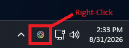

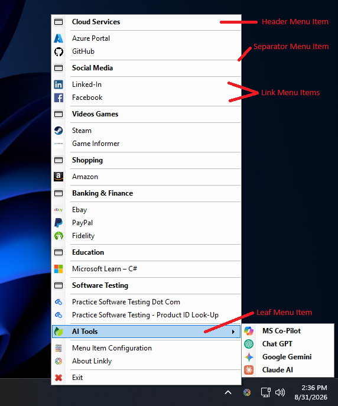

The menu is built from four types of entries:

- **Header** — a bold, labeled section divider (e.g. *Cloud Services*, *Social Media*, *Shopping*) used to group related links together.
- **Separator** — a thin horizontal line used to visually break up sections without adding a label.
- **Link** — a clickable entry (shown with its site's icon) that opens the configured URL in your chosen browser.
- **Leaf** — a special parent node whose child links are displayed as a sub-menu (flyout/drop-down) beneath it, instead of being listed directly in the main menu. In the screenshot above, **AI Tools** is a Leaf node — hovering over it opens a flyout containing MS Co-Pilot, Chat GPT, Google Gemini, and Claude AI. See [Leaf Nodes](#leaf-nodes) below for details.

At the bottom of the menu you'll also find **Menu Item Configuration** (to edit your links), **Preferences**, **About Linkly**, and **Exit**.

## Getting Started

### Prerequisites

- Windows 10/11
- [.NET 10.0 Runtime](https://dotnet.microsoft.com/) (or later)
- Note:  The installer package will install the .NET 10.0 runtime, on your behalf, if you don't already have it installed.

### Installation

1. Download the Linkly Installation Setup package: [Download Linkly Setup](https://github.com/robm3dev/Linkly/releases/download/v1.0.3/LinklySetup.exe)
2. Run the installer and follow the setup wizard.
3. Once installed and executed, Linkly will appear in your system tray — right-click the icon to access your configured links.
4. You can uninstall Linkly directly through the standard Windows Settings --> Add/Remove Programs menu.
5. **Startup and system tray behavior:** Linkly's **Preferences** dialog lets you enable or disable launching Linkly automatically when Windows starts. Preferences also includes a button to open Windows Taskbar Settings, where you can configure whether the Linkly icon is displayed directly in the system tray or hidden in the system tray overflow area. Linkly does not change Windows Taskbar settings on your behalf.

## Configuring Your Links

Right-click the tray icon and select **Menu Item Configuration** to open the Context Menu Items screen.

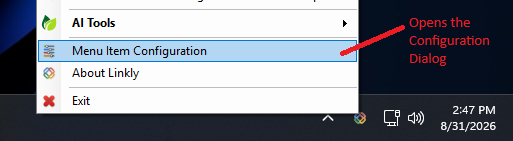

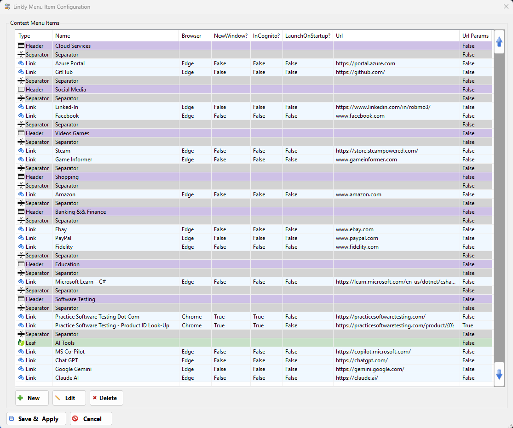
*(Note the highlighted **Leaf** row — "AI Tools" — followed directly by its four child Link rows. See [Leaf Nodes](#leaf-nodes) below for how this is rendered in the tray menu.)*

From here you can:

| Action | Description |
|---|---|
| **New** | Add a new Header, Separator, or Link entry |
| **Edit** | Modify an existing entry |
| **Delete** | Remove an entry |
| **Save & Apply** | Save changes and update the tray menu |
| **Cancel** | Discard changes |

Clicking **New** opens a small menu letting you choose which type of entry to add:

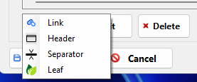

### Entry Types

- **Header** — a labeled section divider in the menu
- **Separator** — a plain visual divider
- **Leaf** - similar to a Header, but will display any following links in a fly-out / sub-menu
- **Link** — a clickable hyperlink, configured via the Link Configuration dialog:

  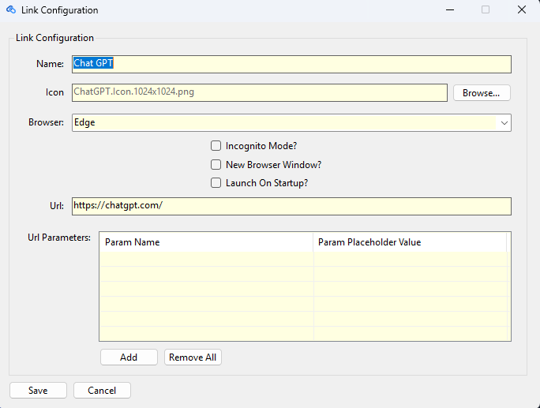

  | Field | Description |
  |---|---|
  | **Name** | Display text in the menu |
  | **Icon** | Custom icon shown next to the link (browse to select an image file) |
  | **Browser** | Which browser to open the link in — supported options: `None`, `Chrome`, `Edge`, `Firefox`, `Internet Explorer`, `Brave`, `Opera`, `Safari`. Linkly automatically detects which of these are installed on your system; if you try to open a link in a browser that isn't installed, you'll be prompted to install it. |
  | **Incognito Mode?** | Whether to open in private/incognito mode |
  | **New Browser Window?** | Whether to open in a new browser window |
  | **Launch On Startup?** | Whether to launch the link automatically when the application starts |
  | **Url** | The target URL |
  | **Url Parameters** | Optional table of named parameters, each with a placeholder value, for building dynamic links (e.g. product ID lookups) |

  **Please Note:** Links will only be launched automatically on application startup if they **do not** use dynamic URL Parameters, and only if their configured browser is currently installed on the system. These two rules prevent a launch from blocking the application's UI on startup — either by prompting for a parameter value, or by failing outright due to a missing browser.

#### Example: Dynamic URL Parameters

URL Parameters let a single link prompt the user for a value at click-time and substitute it into the URL. For example, a "Product ID Look-Up" link might be configured like this:

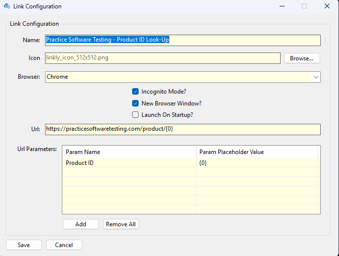

- **Url:** `https://practicesoftwaretesting.com/product/{0}`
- **Param Name:** `Product ID`
- **Param Placeholder Value:** `{0}`

When clicked, Linkly prompts the user for a **Product ID** and substitutes it into the URL in place of `{0}`.

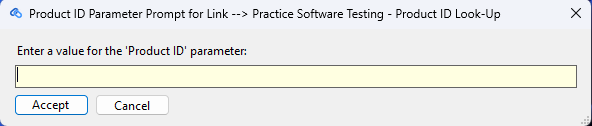

Placeholders are numbered in order — the first parameter must use `{0}`, the second `{1}`, and so on. Linkly enforces that a placeholder is present in the Url before its corresponding parameter name can be configured.

### Leaf Nodes

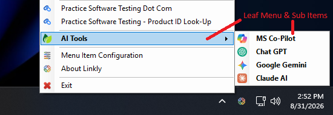

A **Leaf** node behaves like a Header, except that instead of the following links being listed directly in the main menu, they're displayed as a **sub-menu** (flyout/drop-down) beneath the Leaf node itself.

Any Link entries placed directly beneath a Leaf node in `LinklyConfig.json` become children of that Leaf, and will appear as sub-menu items when you hover over or click the Leaf node.

**What ends a Leaf's sub-menu:** a Leaf node's children continue until Linkly encounters either a **Separator** or a standard **Header** or another **Leaf** entry in the configuration. Those entries — and everything after them — are treated as a terminator: it (and any items that follow) will be displayed as normal top-level menu items again or a new Leaf, *not* as children of the initial Leaf. In other words, only consecutive Link entries directly following a Leaf become part of its sub-menu.

**Example configuration structure:**

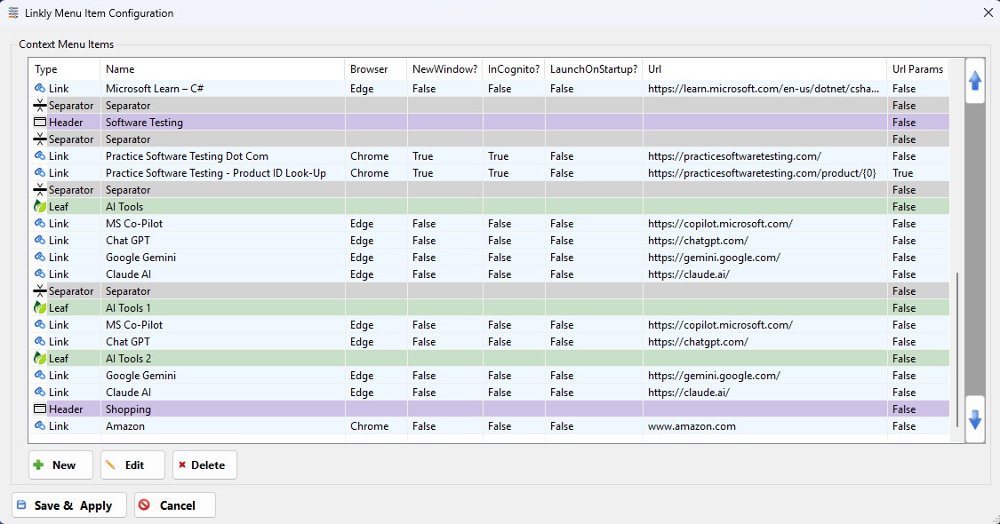

```
Leaf: AI Tools
  Link: MS Co-Pilot
  Link: Chat GPT
  Link: Google Gemini
  Link: Claude AI
Separator                  ← Example 1: Separator terminates the "AI Tools" Leaf
Leaf: AI Tools 1
  Link: MS Co-Pilot
  Link: Chat GPT
Leaf: AI Tools 2           ← Example 2: Leaf terminates the "AI Tools 1" Leaf, and Starts a new "AI Tools 2" Leaf Node
  Link: Google Gemini
  Link: Claude AI             
Header: Shopping           ← Example 3: Header terminates the "AI Tools 2" Leaf
  Link: Amazon
```

In the menu, this renders as:
- **AI Tools** ▸ *(hover to see a sub-menu containing MS Co-Pilot, Chat GPT, Google Gemini, and Claude AI)*
- a normal separator line
- **AI Tools 1** ▸ *(hover to see a sub-menu containing MS Co-Pilot, Chat GPT)*
- **AI Tools 2** ▸ *(hover to see a sub-menu containing Google Gemini, Claude AI)*
- **Shopping** header, followed by the Amazon link as a regular top-level entry
- a standard link to Amazon.com

Leaf nodes are useful for keeping the top-level menu short while still organizing a larger number of related links — see the `AI Tools` entry in the sample `LinklyConfig.json` for a working example.

## Configuration Storage & Backup

The first time Linkly runs, it checks for a **Linkly** folder inside your Windows **Documents** directory (`%USERPROFILE%\Documents\Linkly`). If the folder doesn't exist, Linkly creates it and populates it with:

- A sample configuration file, **`LinklyConfig.json`**
- A set of sample icon images

On every subsequent launch, Linkly simply reuses whatever compatible configuration and icon files it finds in that folder.

### Backing Up and Restoring Your Configuration

Because all of your configuration and icon files live in this single folder, backing up and restoring your setup is as simple as copying a folder:

1. Copy your `Documents\Linkly` folder somewhere safe (external drive, cloud storage, etc.).
2. On a new or reinstalled machine, install Linkly and let it create the default `Linkly` folder on first run.
3. Copy your backed-up files into that folder, overwriting the sample files.
4. Restart Linkly — your full menu configuration and custom icons will be restored exactly as they were.

You should never need to rebuild your configuration from scratch more than once.

### Editing the Configuration File Directly

`LinklyConfig.json` is a plain, human-readable JSON file, so you're not limited to the configuration UI. If you'd rather bulk-create or edit links by hand — for example, generating a large batch of entries with an AI tool — you can edit `LinklyConfig.json` directly and bypass the configuration UI entirely. Linkly will pick up your changes the next time it loads the configuration.

## Preferences

Right-click the Linkly system tray icon and select **Preferences** to open the Preferences dialog.

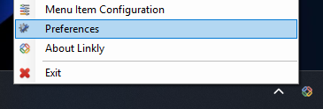

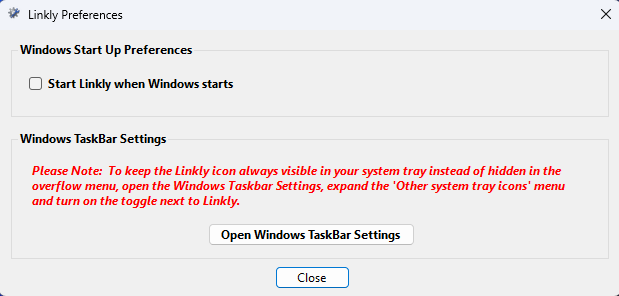

From the Preferences dialog you can:

- **Launch Linkly when Windows starts** — Toggle this option on or off to control whether Linkly automatically starts when you sign in to Windows.
- **Open Windows Taskbar Settings** — Click the button to open the Windows Taskbar Settings screen. From there, you can configure whether the Linkly icon is displayed directly in the system tray or hidden in the system tray overflow area.

### System Tray Icon Visibility

Windows controls which notification/system tray icons are displayed directly on the taskbar. Linkly provides a convenient button to open the appropriate Windows Taskbar Settings screen, but does not modify these Windows settings automatically.

Depending on your version of Windows, look for the system tray icon, taskbar corner overflow, or notification area settings and enable or disable Linkly according to your preference.

## Icons

Linkly ships with a small set of sample icons for the Menu Item Configuration and Settings menu items.  The user can also add their own custom images to the Documents\Linkly folder to make use of them within the tool.

## License

*TBD (No license has been selected yet.)*

## Contributing

*TBD*

## Help & Support

Please send email to [linkly.tool@gmail.com](mailto:linkly.tool@gmail.com) if you should need help, support, would like to report a bug, or have any feedback on Linkly.
